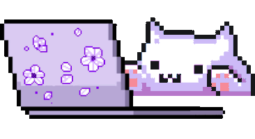

# Responsive Personal Portfolio Website (V1)

 

[Live Website Link (latest version updated)](https://afiacodes.netlify.app/)

<<<<<<< HEAD

=======

>>>>>>> b2f6e869b47f5415b200d4cee2a7bd6cf3b17bb1

## Version
Web version V1

## Languages
- HTML
- CSS
- JavaScript

## Features
- Self-built CSS animations 🌸.
- Smooth scrolling in each section.
- Includes a light and dark mode.
- Developed first with the Mobile First methodology, then for desktop.
- Compatible with all mobile devices and with a beautiful and pleasant user interface.

## Color Pallete

| Color          | Hex       |
| -------------- | --------- |
| Purple         | `#9c4cff` |
| Light Purple   | `#a463f2` |
| Hue            | `250`     |

## Preview

